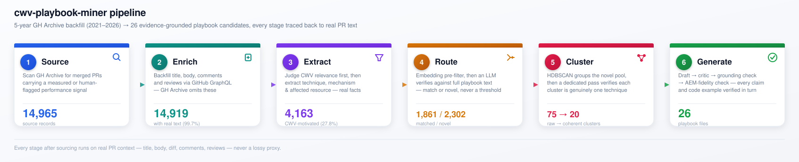

# cwv-playbook-miner

A pipeline that mines real, merged GitHub PRs for measured Core Web Vitals
(CWV) techniques and turns them into evidence-grounded playbook candidates
— each one traceable back to the specific PRs that support it, and each
decision along the way grounded in real PR text, never a short phrase or a
bare similarity threshold.

Candidates land in [`playbooks/`](playbooks/) for manual review — nothing
is auto-merged into the curated [`cwv-playbooks-handoff/`](cwv-playbooks-handoff/)
set. The mined dataset (raw source records and generated candidates) is
published at
**[Ayush-Singh/cwv-strategy-mining-dataset](https://huggingface.co/datasets/Ayush-Singh/cwv-strategy-mining-dataset)**.

## Pipeline



Numbers above are from the latest full run over the 5-year source corpus
(see [Results](#results)). Every stage after sourcing runs on real PR
context — title, body, diff, comments, reviews — never a lossy proxy:

### 1 — Source
Scans [GH Archive](https://www.gharchive.org/)'s public event stream for
merged PRs carrying one of four free signals: a bot comment/review matching
a known before/after-report template (Lighthouse CI, RelativeCI,
bundlesize, Calibre, WebPageTest, ...), or a **non-bot** human review/
review-comment matching a broad performance vocabulary (LCP/CLS/INP,
"bundle size", "lazy load", "code split", ...) — the latter channel has no
parsed delta, so direction gets judged downstream rather than assumed.
`ProcessPoolExecutor`-parallel; `backfill` runs it in resumable,
checkpointed chunks.

### 2 — Enrich
GitHub strips PR `title`/`body` from the free `PullRequestEvent` stream
entirely, so nothing above this stage has real PR text — only diffs.
`enrich-pr-text` backfills title, body, every issue comment, review, and
inline review comment via GitHub's **GraphQL** API, batched via query
aliases (REST would need up to 4 calls/PR; this batches ~40 PRs per
request). `refetch-truncated` follows up with a fully paginated per-PR
re-fetch for anything that hit a page cap on the first pass, so nothing is
silently incomplete.

### 3 — Extract
Two dedicated LLM passes, not one bundled call. First, a single focused
yes/no: would this PR's actual code change move **LCP, CLS, INP**, or a
closely related metric (TTFB, FCP, TBT, bundle size, request count) —
forced explicit reasoning before the verdict, not a guess. Only PRs that
pass extract further: `technique`, `mechanism`, `affected_resource`,
`render_phase`, a one-sentence `description`, and (for human-flagged PRs
only) an inferred direction — objective, checkable facts, never a fixed
a-priori taxonomy bucket. This structured output is the *only* thing ever
embedded downstream — never raw title/diff/comments directly.

### 4 — Route
Decides whether a PR is a genuine instance of one of the 20 curated
playbooks, or something novel. Embedding similarity narrows each PR to its
top-3 candidate playbooks (a fast pre-filter, never the decision itself);
an LLM then verifies against the **full text** of those candidates. The
same structured-fact shape from stage 3 is extracted once from each
curated playbook too, so both sides of every comparison are the same kind
of text — comparing a terse fact sheet to a prose "What this addresses"
section was a real, measured source of false matches in an earlier version
of this routing step.

### 5 — Cluster
HDBSCAN groups the novel pool by embedding distance — then, critically, a
dedicated **coherence-verification** call reads several full PR evidence
excerpts per candidate cluster and confirms it's genuinely one technique
before anything gets labeled. Density-based clustering can chain loosely-
related items together (A similar to B similar to C, but A and C not
actually alike); this step exists specifically to catch that, and it does
— see [Results](#results). Surviving clusters get a directional-consistency
check, then an LLM labels `issue_type`, `risk_tier`, `applicable_flavors`,
and — a hard gate, not a hint — `cwv_relevant`, using real evidence rather
than a handful of short phrases.

### 6 — Generate
Draft → critic → **grounding check** → **AEM-fidelity check**. Evidence
selection is diversity-weighted (caps any single repo's contribution) so
one codebase's repeated pattern can't single-handedly validate a
technique. Draft and critic write against the curated format spec and two
style references; the grounding pass then verifies every concrete claim —
especially anti-pattern "why this is bad" reasoning — actually traces to a
cited PR rather than sounding-plausible invention. The AEM-fidelity pass
runs last: source PRs are ordinary web code, so a draft can carry over a
React/Vue example verbatim — this dedicated check rewrites any code
example that isn't genuinely native to the flavor(s) it's claimed for
(`decorate(block)` for eds, HTL/Sling Models/clientlib for cs/ams).

## Results

Full run over the 5-year backfilled source corpus (2021–2026):

| Stage | Outcome |
|---|---:|
| Source records | 14,965 |
| Enriched with real title/body/comments | 14,919 (99.7%) |
| CWV-motivated (survived stage 3's relevance gate) | 4,163 (27.8%) |
| Routed to an existing playbook | 1,861 |
| Routed as novel | 2,302 |
| Raw HDBSCAN clusters | 75 |
| Confirmed coherent (survived stage 5's verification) | 20 |
| Final novel techniques (passed consistency + relevance) | 9 |
| Existing playbooks enriched with new evidence | 17 |
| **Generated playbook files** | **26** |

## Experiment specifications

Exact configuration behind the numbers above.

**Models** (Azure OpenAI, `openai-compatible` backend, `/openai/v1` path):

| Role | Model | Used by |
|---|---|---|
| Chat completion | `gpt-5.4-mini` | every LLM stage — relevance, extraction, routing verify, coherence, labeling, draft/critic/grounding/AEM-fidelity |
| Text embedding | `text-embedding-3-small` | routing's pre-filter, clustering's HDBSCAN input |

Both were verified as actually deployed and callable on the Azure Foundry
resource before the run (the `/models` catalog lists 452 entries, most not
callable — `gpt-5.4`/`gpt-5.4-mini` and `text-embedding-3-small`/`-large`
work; `gpt-5` and `text-embedding-ada-002` do not, despite `gpt-5` being
the deployment name in `.env`). `--backend openai` (plain OpenAI) and
`--backend claude-cli` are also supported for any stage.

**Call parameters** (`llm/client.py`): `temperature=0.0` for every
structured/JSON call (relevance, extraction, routing verify, coherence,
labeling — determinism matters more than variety when the output is a
judgment), `temperature=0.2` for free-text generation calls (draft,
critic, grounding check, AEM-fidelity check). Every call retries
transient network/5xx/429 errors up to 4 times with exponential backoff;
a real 4xx is never retried, always raised as `LLMError`.

**Batching**: extraction and routing-verify batch records for throughput
(`BATCH_SIZE=10` for extraction, `VERIFY_BATCH_SIZE=6` for routing verify,
`BATCH_SIZE=40` PRs/request for GraphQL enrichment via query aliases);
clustering's coherence/labeling calls batch `CLUSTER_CALL_BATCH_SIZE=4`
clusters per call — found necessary after an unbatched 72-cluster call
measured ~2M characters (~508K tokens) and hit an HTTP 400.

**Routing**: embedding pre-filter narrows each PR to its `TOP_K=3`
candidate existing playbooks by cosine similarity before the LLM verifies
against their full text — the embedding score is never the routing
decision itself.

**Clustering**: `sklearn.cluster.HDBSCAN(min_cluster_size=4, min_samples=2)`
on L2-normalized embeddings; a cluster additionally needs
`distinct_repo_count >= 2` to survive size/repo eligibility before the
coherence-verification call ever sees it.

**Timeouts**: 180s per LLM call (`--timeout`, all stages) unless
overridden.

**Compute environment**: the 14,965-record enrichment pass (GitHub
GraphQL title/body/comments/reviews backfill) took ~35 minutes wall time,
most of it the `perf_flagged` file (~8,500 records); it includes its own
retry-with-backoff for transient `gh api graphql` failures, separate from
the LLM client's. No end-to-end wall-clock or dollar-cost figure was
recorded for the full extract → route → cluster → generate run on this
architecture — the effort estimate from an earlier, structurally
different single-pass design (~$4-6 for the equivalent corpus) does not
carry over and isn't repeated here.

## Setup

```bash
python3 -m venv .venv
source .venv/bin/activate
pip install -e .
```

Copy `.env.example` to `.env` and fill in `OPENAI_API_KEY` (default
backend) or `LLM_BASE_URL`/`LLM_API_KEY`/`LLM_MODEL_NAME` for an
OpenAI-compatible endpoint (Azure OpenAI, vLLM, etc. — pass
`--backend openai-compatible`). Every LLM stage requires one of these;
there is no fallback.

## Usage

```bash
# Sourcing
cwv-playbook-miner source --start 2026-08-10T00:00:00 --hours 24 --workers 16
cwv-playbook-miner backfill --start 2021-08-18T00:00:00 --end 2026-08-18T00:00:00 \
  --chunk-hours 24 --workers 16 --api-workers 4

# Enrichment (GitHub GraphQL — needs `gh` authenticated)
cwv-playbook-miner enrich-pr-text
cwv-playbook-miner refetch-truncated

# Pipeline, stage by stage
cwv-playbook-miner extract --backend openai-compatible --model gpt-5.4-mini
cwv-playbook-miner extract-playbooks --backend openai-compatible --model gpt-5.4-mini
cwv-playbook-miner route --backend openai-compatible --model gpt-5.4-mini \
  --embed-provider openai-compatible --embed-model text-embedding-3-small
cwv-playbook-miner cluster --backend openai-compatible --model gpt-5.4-mini \
  --embed-provider openai-compatible --embed-model text-embedding-3-small
cwv-playbook-miner enrich-extract
cwv-playbook-miner generate --backend openai-compatible --model gpt-5.4-mini

# Or chain everything
cwv-playbook-miner playbooks --backend openai-compatible --model gpt-5.4-mini \
  --embed-provider openai-compatible --embed-model text-embedding-3-small
```

`--workers` controls sourcing/extraction thread-pool size. `extract`,
`route`, `cluster`, and `generate` are all cache/resume-aware
(`data/processed/.{technique_extract,route}_cache/`, and `generate` skips
any output file that already exists unless `--overwrite` is passed) — a
crashed run can just be re-invoked.

## Testing

```bash
.venv/bin/pytest -q
```

## Repo layout

```text
src/cwv_playbook_miner/
  sourcing/       stage 0 -- GH Archive scan, gh api calls
  labeling/       stage 0 -- bot-report template registry, structural fingerprinting
  enrichment/     stage 2 -- GitHub GraphQL title/body/comments/reviews backfill
  extraction/     stages 3-5 -- relevance + technique extraction, routing input,
                  coherence-verified clustering, playbook-side fact extraction,
                  diversity-weighted evidence selection
  routing/        stage 4 -- retrieve-then-verify routing
  generation/     stage 6 -- draft + critic + grounding-check rendering
  embedding.py    shared text-embedding provider (openai / openai-compatible / local)
  llm/            shared LLM client (openai / openai-compatible / claude-cli backends,
                  with retry-with-backoff on transient failures)
data/processed/  every stage's JSONL output (gitignored)
playbooks/
  new_playbooks/  full new {issue_type}.md candidates -- front matter includes source_prs
  enriched/       new approach/anti-pattern *.enrichment.md blocks for existing playbooks
cwv-playbooks-handoff/  the 20 curated playbooks generation reads from; never written to
docs/pipeline-flow.svg   the diagram above
docs/hf-dataset-card.md  source of truth for the HF dataset's README (pushed manually)
SESSION_NOTES.md  chronological design log -- what was found, why each fix was made,
                  and what it was verified against
```
